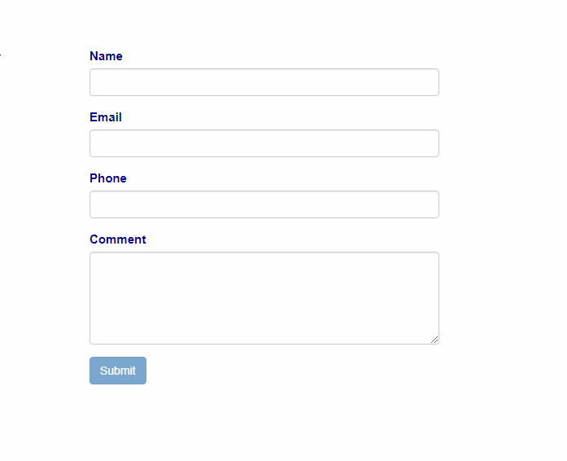

# 

## About

>This project concerns React.js form app connected to Firebase database.
It includes React Router for redirection on form submission and Node module - validator, to validate user input.  

## Installation and running

>npm install - to install dependencies (Node.js )
npm start - to run the application (Webpack build will be created and webpack-dev-server will launch the applcation on port 8080)

>To verify user submission, you should have your own instance of Firebase database set up, and change the path in the firebase.js config file

## Image
